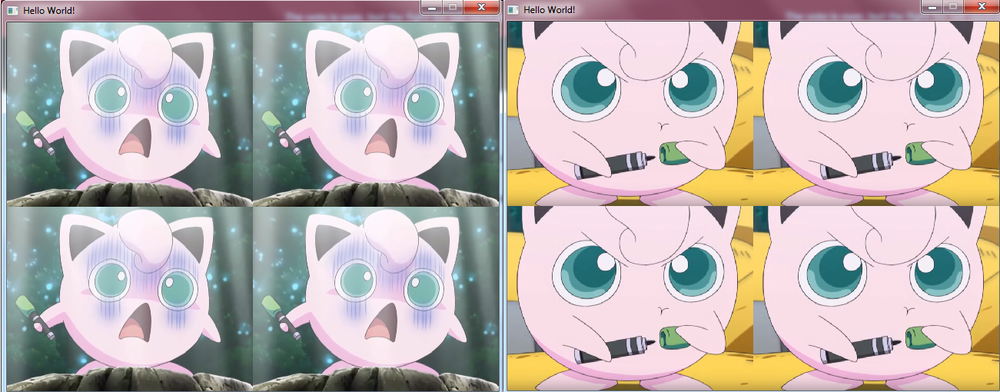
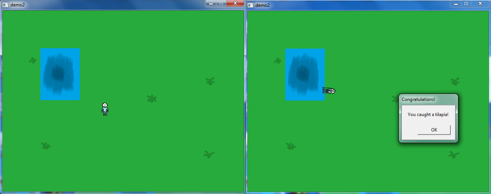

trying out the SDL library! :D     
    
demo1: this demo demonstrates some features of SDL, such as image loading, image scaling, converting surface to texture, and handling some basic input like mouse clicks (the image changes on click).    
    
    
demo2: this demo lets you control a character and do some fishing! I practiced some OOP here and implemented some very elementary collision detection.    
     

    
resources I thought were helpful:    
http://www.willusher.io/pages/sdl2/    
http://lazyfoo.net/tutorials/SDL/index.php