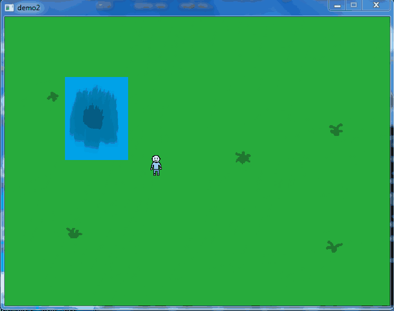
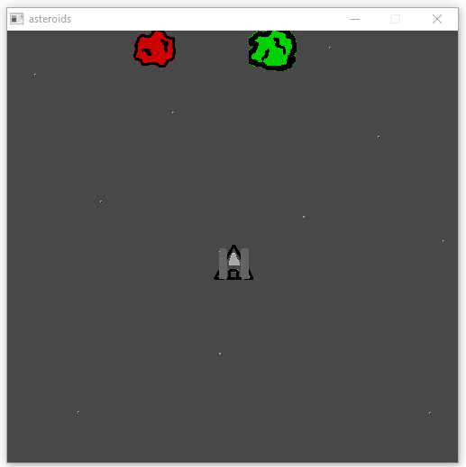
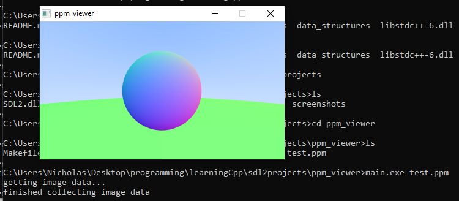

trying out the SDL2 library with C++     
    
note: make sure to have SDL2.dll in the same directory as the excutables when running them!    
    
**demo**: this demo demonstrates some features of SDL, such as image loading, image scaling, converting surface to texture, and handling some basic input like mouse clicks (the image changes on click).    
    
    
**fishing**: this project lets you control a character and do some fishing! If you're lucky, you might catch something! I practiced some OOP here and implemented some very elementary collision detection.    
     
    
**asteroids**: this project is based off the arcade classic of the same name. This one is a lot worse though but it was fun trying to think about and implement the same mechanics. It's definitely incomplete and hopefully I'll clean it up in the future.    
     
    
**ppm_viewer**: a .ppm image file viewer! useful when working on "Raytracing in One Weekend".    
    
    
resources I thought were helpful:    
http://www.willusher.io/pages/sdl2/    
http://lazyfoo.net/tutorials/SDL/index.php